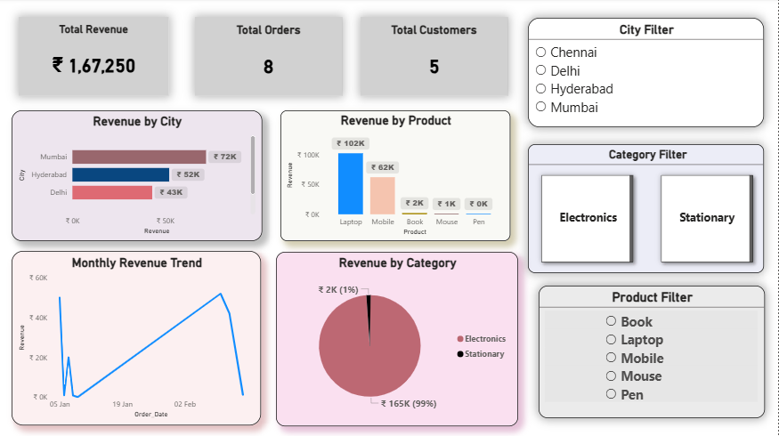

Power BI Sales Dashboard

Project Overview

## Dashboard Preview

This project presents an interactive Power BI dashboard developed to analyze sales performance and generate business insights.

Dashboard Features

- Total Revenue KPI
- Total Orders KPI
- Total Customers KPI
- Revenue by Product
- Revenue by City
- Monthly Revenue Trend
- Revenue by Category
- Interactive Filters (City, Product, Category)

Business Insights

- Electronics generated the highest revenue.
- Laptop was the top-performing product.
- Mumbai contributed the highest sales revenue.
- Revenue increased from January to February.

Tools Used

- Power BI
- DAX
- Data Visualization
- Business Intelligence

Project Files

- PowerBI_Sales_Dashboard.pbix
- PowerBI_Sales_Dashboard_Report.pdf
- Dashboard Screenshots

Author

Bushra Jahan
